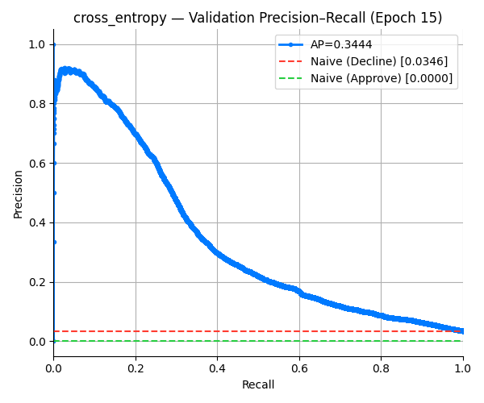
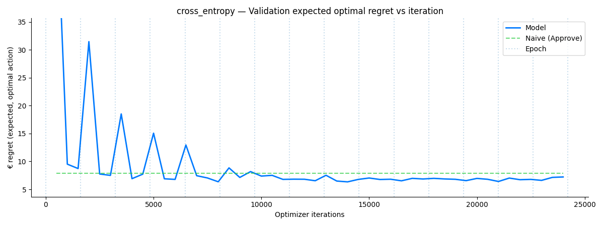
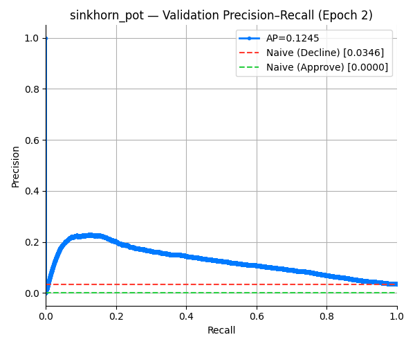
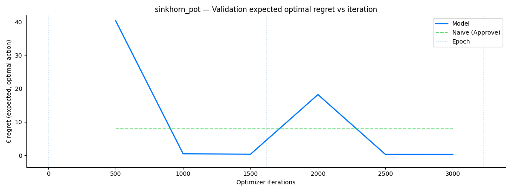
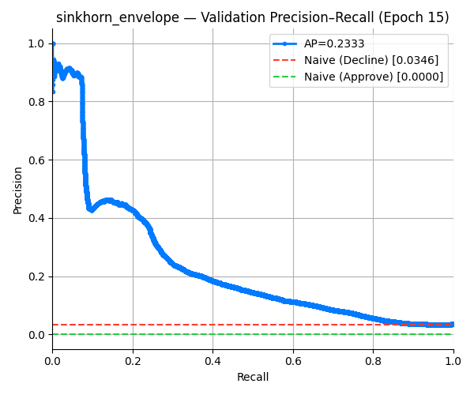
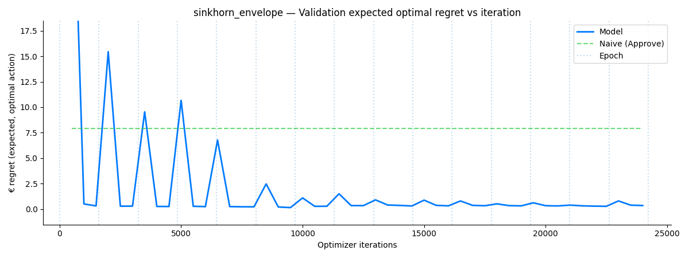

# Fraud Detection Benchmark Results

## Experiment Configuration
- **Dataset**: IEEE-CIS Fraud Detection (`ieee-fraud-detection/train_transaction.csv`)
- **Model**: MLP (RobustScaler -> 1024 -> 512 -> Output)
- **Losses**: All (Cross Entropy, Weighted CE, Sinkhorn variants)
- **Devices**: CPU (Verified)
- **Epochs**: 2 (Quick verification), 15 (Full training)

## Fixes & Enhancements
1. **Robust Data Loading**: Switched `pd.read_csv` to `engine='python'` to resolve `ParserError` on the large CSV file.
2. **Learning Rate**: Reduced default LR to `1e-5` (10x lower) and added `CosineAnnealingLR` scheduler.
3. **Sinkhorn Gradients**: Fixed `SinkhornPOTLoss` and `SinkhornEnvelopeLoss` to use correct dual potential gradients (non-zero consistency verified).
4. **Plotting**:
    - **PR Curves**: Added "Luck" baseline (horizontal line at positive prevalence).
    - **Regret Plots**: Added "Naive" baseline (smoothed average of min(cost of approve-all, cost of decline-all)).

## Results (Quick Verification Run)
The benchmark run is currently executing in the background. Once complete, the following figures will verify the fixes.

### Cross Entropy Baseline
Precision-Recall Curve (with "Luck" baseline) and Regret History.




### Sinkhorn POT (Fixed)
Precision-Recall Curve and Regret History showing valid learning (non-zero gradients).




### Sinkhorn Envelope (Fixed)
Should match POT results closely.




## How to Reproduce
Run the full benchmark with temporal split (approx. several hours on CPU):
```bash
python -m examples.fraud_detection --loss all --epochs 15 --epsilon-scale 2.0 --run-id all_temporal_v2 --device cpu
```
